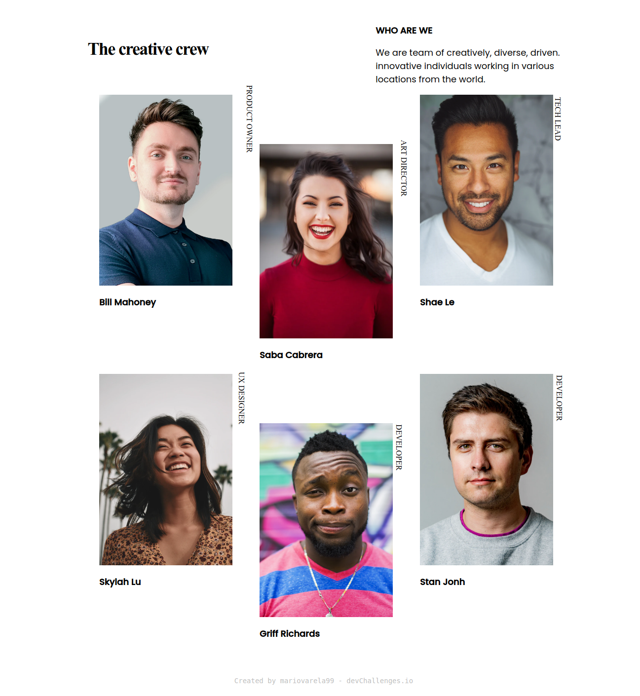

<!-- Please update value in the {}  -->

<h1 align="center">{Team Dev Challenges}</h1>

   Solution for a challenge from  <a href="http://devchallenges.io" target="_blank">Devchallenges.io</a>.

  <h3>
    <a href="https://https://mariovarela99.github.io/TeamPage_Challenge/">
      Demo
    </a>
     | 
    <a href="https://https://mariovarela99.github.io/TeamPage_Challenge/">
      Solution
    </a>
     | 
    <a href="https://devchallenges.io/challenges/hhmesazsqgKXrTkYkt0U">
      Challenge
    </a>
  </h3>

## Overview

- You can see a demo in my github
- I had a good experience with positioning elements and responsivity
- I learned more about white-space and positioning elements in the window
- 😇

### Built With

> Sass
> HTML

## Contact

- Website [github.com/mariovarela99/me.io](https://github.com/mariovarela/me.io)
- GitHub [@mariovarela99](https://mariovarela99)
- Twitter [@MrioVarela4](https://MrioVarela4)
